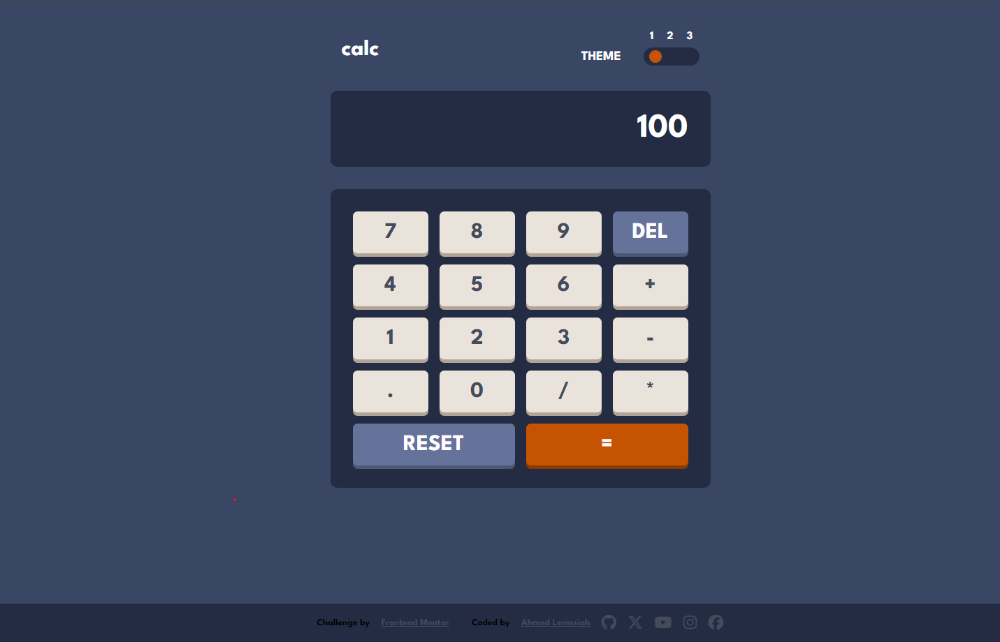

# Frontend Mentor - Calculator app solution
Hello there, my name is Ahmed Lemssiah, and this is my solution to the [Calculator app challenge on Frontend Mentor](https://www.frontendmentor.io/challenges/calculator-app-9lteq5N29). 

 ## Table of contents

- [Overview](#overview)
  - [The challenge](#the-challenge)
  - [Screenshot](#screenshot)
  - [Links](#links)
- [My process](#my-process)
  - [Built with](#built-with)

## Overview
 As a developer, there are some things to do to honor the community:
- Start with the classic "Hello, world!" for your first attempts.
- Make sure to mark your "First commit" when you commit your code.
- Embrace the developer lifestyle: having no life and no friends (just kidding!).
- And of course, don't forget about the calculator! You have to write your own calculator. 
### The challenge

Users should be able to:

- See the size of the elements adjust based on their device's screen size
- Perform mathmatical operations like addition, subtraction, multiplication, and division
- Adjust the color theme based on their preference
- **Bonus**: Have their initial theme preference checked using `prefers-color-scheme` and have any additional changes saved in the browser

### Screenshot

### Links

- Solution URL: [the Files](https://github.com/Arteque/calculator-app)
- Live Site URL: [Live Page](https://arteque.github.io/calculator-app/)

## My process

### Built with

- Semantic HTML5 markup 😎
- CSS custom properties 😉
- Flexbox 😊
- CSS Grid 😄
- Mobile-first workflow 😇
- Javascript 😁

